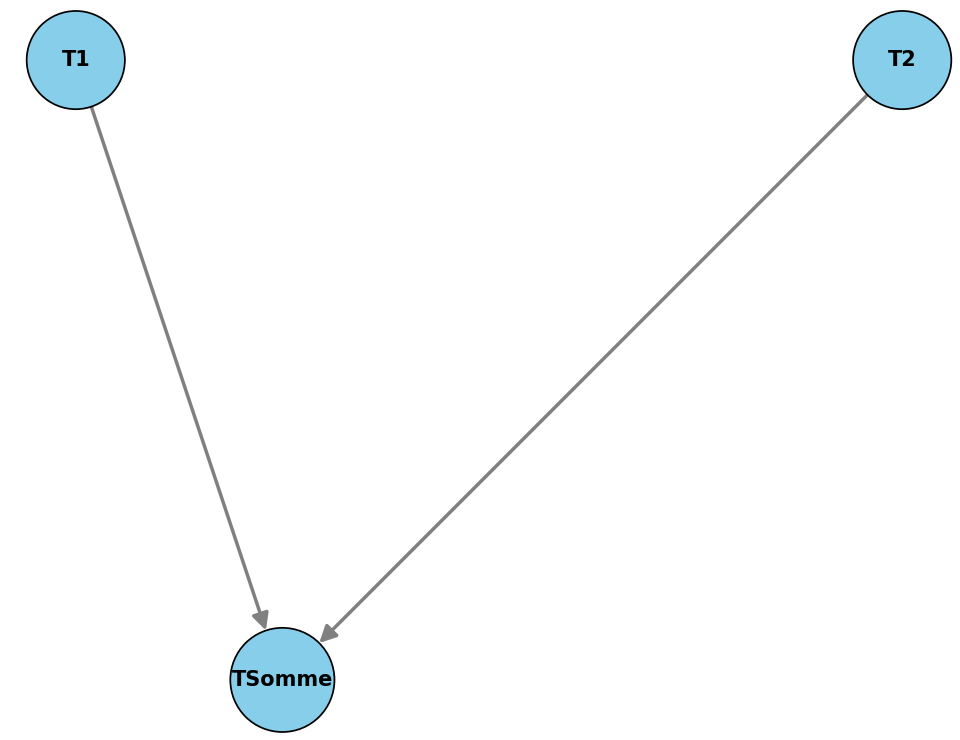

# HyperFlow Python Library

HyperFlow is a Python library that provides an easy solution to automize the maximum parallelization of task systems.  

## Table of Contents

1. [Key Features](#key-features)
2. [Installation](#installation)
3. [Usage](#usage)
4. [Contribution Guidelines](#contribution-guidelines)
5. [License](#license)
6. [Acknowledgments](#acknowledgments)

## Key Features 

- **Sequential and Parallel Execution**: Execute tasks sequentially or in parallel. The library ensures that tasks are executed in the correct order based on their dependencies.

- **Graph Visualization**: Visualize task systems as dependency graphs using the `draw` method. This helps in understanding the structure and dependencies of the task system.

- **Deterministic Testing**: Test if a task system is deterministic with the `detTestRnd` method. This ensures that the task system produces consistent results across multiple runs.

- **Performance Comparison**: Compare the execution times of sequential and parallel task systems using the `parCost` method. This helps in identifying performance improvements gained through parallelization.

- **Customizable Task Execution**: Define custom run functions for tasks to perform specific operations. The library supports tasks that read from and write to shared resources.

## Installation

To install the HyperFlow Python Library, follow these steps:

1. **Clone the repository**:
    ```sh
    git clone https://github.com/ttmassa/hyperflow.git
    cd hyperflow
    ```

3. **Install the required dependencies**:
    ```sh
    pip install -r requirements.txt
    ```

4. **Run the tests** to ensure everything is set up correctly:
    ```sh
    pytest 
    ```

You are now ready to use the HyperFlow Python Library!

## Usage

Here is a simple example of how to use the HyperFlow Python Library to create and execute a task system:

```python
from src.task import Task
from src.task_system import TaskSystem

# Define tasks
def runT1():
    print("Running Task 1")

def runT2():
    print("Running Task 2")

def runTSomme():
    print("Running Task Somme")

t1 = Task(name="T1", writes=["X"], run=runT1)
t2 = Task(name="T2", writes=["Y"], run=runT2)
tSomme = Task(name="TSomme", reads=["X", "Y"], writes=["Z"], run=runTSomme)

# Define task system with dependencies
task_system = TaskSystem(
    tasks=[t1, t2, tSomme],
    precedence={"T2": ["T1"], "TSomme": ["T1", "T2"]}
)

# Run the task system sequentially
task_system.runSeq()

# Run the task system in parallel
task_system.run()

# Visualize the task system as a dependency graph
task_system.draw()

# Test if the task system is deterministic
task_system.detTestRnd()

# Compare the execution times of sequential and parallel task systems
task_system.parCost()
```

Here is what the dependency graph from the example looks like:


## Contribution Guidelines 

This project is open source, and everyone is more than welcome to contribute! If you encounter any issues or have suggestions for improvements, please feel free to notify us or submit a pull request. Here are some guidelines to help you get started:

1. **Fork the Repository**: Start by forking the repository to your GitHub account.

2. **Clone the Repository**: Clone the forked repository to your local machine.
    ```sh
    git clone https://github.com/ttmassa/hyperflow.git
    cd hyperflow
    ```

3. **Create a Branch**: Create a new branch for your feature or bug fix.
    ```sh
    git checkout -b feature-or-bugfix-name
    ```

4. **Make Changes**: Make your changes to the codebase. Ensure that your code follows the project's coding standards and conventions.

5. **Commit Changes**: Commit your changes with a descriptive commit message. If it's a fix, please start your commit message this way:
    ```sh
    git commit -m "fix: description"
    ```
    If it's a new feature, please start your commit message this way:
    ```sh
    git commit -m "feat: description"
    ```
6. **Push Changes**: Push your changes to your forked repository.
    ```sh
    git push origin feature-or-bugfix-name
    ```

7. **Submit a Pull Request**: Go to the original repository on GitHub and submit a pull request. Provide a clear description of your changes and the problem they solve.

8. **Review Process**: Your pull request will be reviewed by one of us. They may request changes or provide feedback. Once your pull request is approved, it will be merged into the main branch.

Thank you for contributing to the HyperFlow Python Library!

## License

This project is licensed under the Apache-2.0 License. See the [LICENSE](LICENSE) file for more details.

## Acknowledgments

This project is part of a practical assignment for the Operating Systems course at Université d'Évry Val d'Essonne - Paris Saclay.